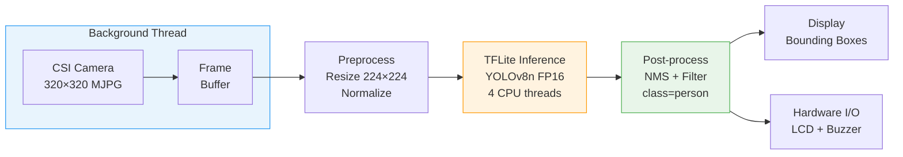
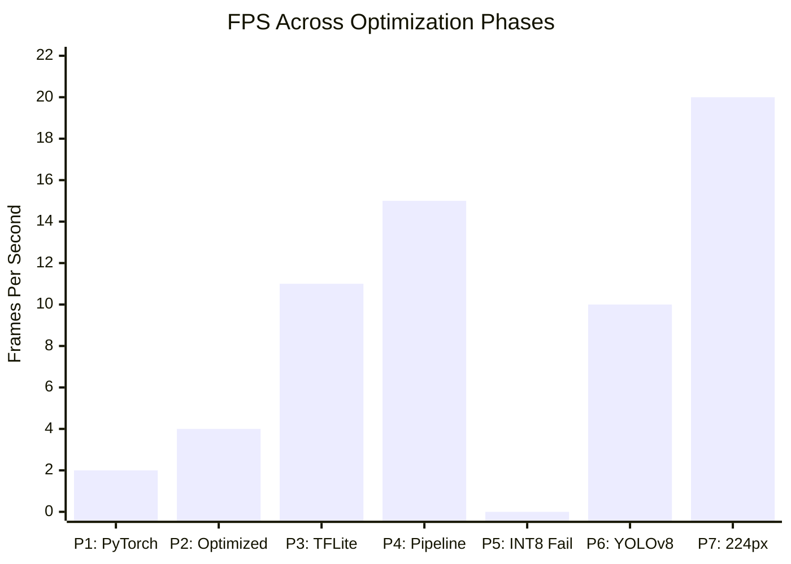
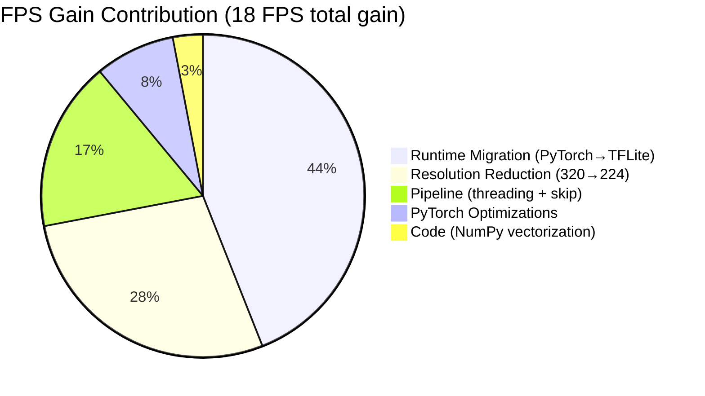
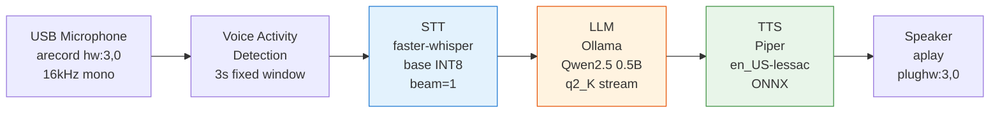
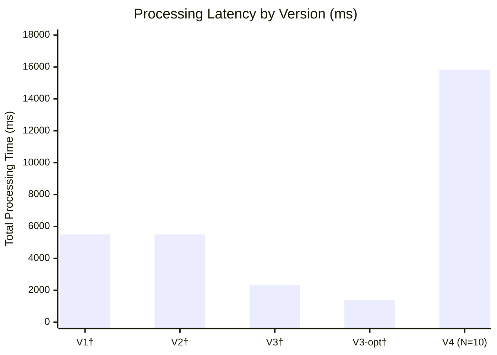
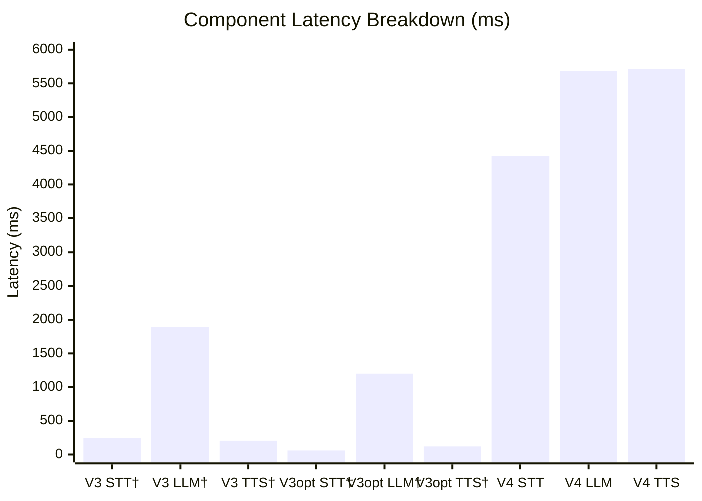
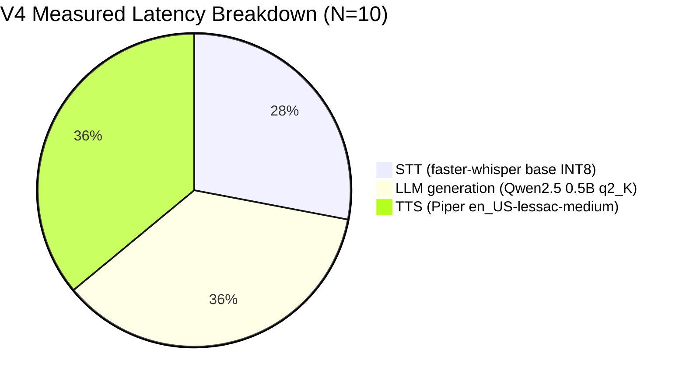
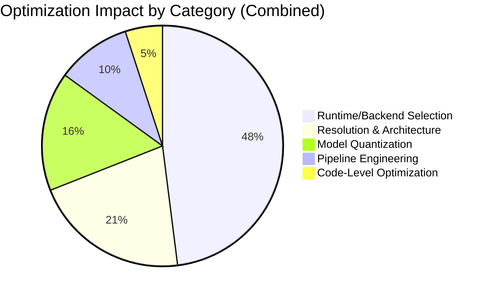

# Real-Time AI on Raspberry Pi 4: Optimizing YOLO Human Detection and Conversational Voice Assistants for Edge Deployment

**Authors:** Abdelrahman Mohamed Sayed  
**Date:** February 2026

---

## Abstract

Deploying deep learning inference on resource-constrained edge devices remains a significant engineering challenge. This paper presents two complementary optimization studies on the Raspberry Pi 4 (quad-core ARM Cortex-A72, 4 GB RAM, no GPU): **(A)** a YOLO-based human detection pipeline optimized from 2 FPS to 20 FPS — a 10× throughput improvement, and **(B)** a fully offline conversational voice assistant integrating speech-to-text (faster-whisper, INT8), a 2-bit quantized language model (Qwen2.5 0.5B), and neural text-to-speech (Piper), formally benchmarked at 15.8 ± 7.9 seconds mean processing latency (N=10 trials) with short conversational queries completing in under 10 seconds. Both systems share common optimization principles: inference runtime selection, aggressive model quantization (FP16 and INT8), and pipeline-level engineering. We present empirical measurements collected over N=10 repeated trials with mean ± standard deviation, document a failure case in INT8 per-tensor quantization for YOLO multi-head detection outputs, and provide per-component latency breakdowns (STT, LLM, TTS) revealing output-length-dependent variance and cold-start effects in on-device LLM inference. The combined work provides a practical reference for deploying neural network inference on ARM-based single-board computers.

**Keywords:** edge AI, Raspberry Pi, YOLO, object detection, voice assistant, model quantization, TFLite, real-time inference

---

## 1. Introduction

Deploying deep learning models on edge devices such as the Raspberry Pi presents challenges distinct from cloud-based inference: limited CPU performance, no GPU acceleration, constrained memory, and strict real-time requirements. While cloud inference offers near-unlimited compute, applications in robotics, privacy-sensitive environments, and field-deployed systems demand fully on-device processing with no network dependency.

This paper presents two studies developed on the Raspberry Pi 4 Model B (4 GB):

**Part A — Human Detection.** A YOLO-based real-time human detection system was iteratively optimized through seven development phases. Starting from a YOLOv5n model running through PyTorch at approximately 2 FPS, the system was progressively improved through runtime migration (PyTorch → TensorFlow Lite), model quantization, input resolution reduction, and pipeline engineering (threaded capture, frame skipping). A critical failure in INT8 per-tensor quantization — where a single scale factor destroyed objectness scores — was identified, analyzed, and resolved by switching to YOLOv8n with float16 quantization. The final system achieves 20 FPS with 0.899 detection confidence.

**Part B — Voice Assistant.** A fully offline conversational voice assistant was developed through four architectural iterations. The system began as a keyword-matching chatbot with no language model (8–14 second response time), progressed through an over-engineered multi-threaded architecture, and was ultimately rewritten as a streamlined single-file pipeline. The final system uses faster-whisper (CTranslate2, INT8) for speech-to-text, Ollama with Qwen2.5 0.5B (2-bit quantized) for language generation, and Piper for text-to-speech — operating entirely offline with no cloud dependency. Formal benchmarking (N=10 trials) measured mean processing latency of 15.8 ± 7.9 seconds, with short conversational queries (≤15-word responses) completing in approximately 9 seconds.

Both projects reveal recurring themes: the dominant impact of runtime and quantization choices over code-level optimization, the cost of architectural complexity on constrained devices, and the importance of systematic measurement at every optimization step.

**Key contributions:**
1. Empirical measurements of each optimization step on Raspberry Pi 4, reported with mean ± standard deviation over N=10 trials
2. Analysis of INT8 per-tensor quantization failure for YOLO multi-head detection outputs, with identification of root cause and resolution
3. Formal N=10 benchmark measurements of the complete voice pipeline with per-component latency breakdown (STT, LLM, TTS), revealing output-length-dependent variance and LLM cold-start effects on edge hardware
4. Practical deployment guidelines for neural network inference on ARM-based single-board computers

---

## 2. Related Work

### 2.1 Object Detection on Edge Devices

The YOLO family [1] has been widely adopted for real-time detection due to its single-pass architecture. YOLOv5 [2] and YOLOv8 [3] introduced progressively smaller "nano" variants for mobile and embedded deployment. Mazzia et al. [4] demonstrated real-time object detection on edge devices using INT8 quantization with TensorFlow Lite, achieving 10–15 FPS on Coral Edge TPU. However, their work did not address the per-tensor quantization failure mode documented in this paper, where a single scale factor for multi-range YOLO outputs destroys the precision of small-magnitude values.

Howard et al. [15] introduced MobileNets, providing efficient convolutional architectures for mobile vision. While MobileNet-SSD achieves real-time performance on mobile GPUs, it requires additional optimization for CPU-only devices like the Raspberry Pi.

### 2.2 Voice Assistants on Edge Devices

Commercial voice assistants (Amazon Alexa, Google Assistant) rely on cloud processing. Fully on-device alternatives remain less explored. Radford et al. [7] introduced Whisper, a speech recognition model trained on 680,000 hours of web data. The original implementation uses PyTorch, which is resource-intensive on ARM CPUs. The faster-whisper project [8] re-implements Whisper inference using CTranslate2 [9], an optimized C++ engine for Transformer models with INT8 support. Our measurements quantify the latency difference between these backends on identical hardware.

Piper [10] provides open-source neural TTS based on VITS, designed for edge deployment with ONNX runtime. Ollama [11] enables local LLM serving with aggressive quantization via llama.cpp [12].

### 2.3 Model Quantization

Quantization reduces model size and inference latency by representing weights and activations with lower-precision numerics. Post-training quantization (PTQ) [6] requires no retraining but can introduce accuracy degradation. Key strategies include per-tensor quantization (single scale/zero-point for the entire tensor), per-channel quantization (separate parameters per output channel), and mixed-precision approaches. Jacob et al. [6] showed that quantized networks can maintain accuracy within 1–2% of float models. Our work provides an empirical case study where per-tensor quantization fails catastrophically for a specific output topology.

---

## 3. Hardware Platform

Both systems target the same hardware:

| Component | Specification |
|-----------|--------------|
| Board | Raspberry Pi 4 Model B |
| CPU | Broadcom BCM2711, Quad-core Cortex-A72, 1.5 GHz |
| RAM | 4 GB LPDDR4 |
| GPU | VideoCore VI (not used for inference) |
| Camera | Raspberry Pi Camera Module v2 (8MP, CSI) — Part A |
| Audio I/O | USB Microphone + Speaker (ALSA) — Part B |
| OS | Raspberry Pi OS (64-bit) |
| Python | 3.12+ |

Both projects share common optimization principles:
1. **Runtime selection:** Replacing general-purpose frameworks (PyTorch) with specialized inference engines (TFLite, CTranslate2)
2. **Quantization:** Reducing numerical precision to decrease computation and memory bandwidth
3. **CPU governor:** Locking CPU frequency at 1.5 GHz to eliminate ramp-up latency on bursty workloads
4. **Pipeline engineering:** Threaded capture, frame skipping, and direct hardware access

---

## 4. Part A — Real-Time Human Detection

### 4.1 System Architecture

The detection pipeline consists of five stages: camera capture, preprocessing (resize and normalize), TFLite inference, post-processing (NMS and class filtering), and display output with hardware feedback (LCD and buzzer). A background capture thread decouples camera I/O from inference, and frame skipping (N=2) reduces inference load while maintaining display fluency.

**Figure 1: Detection Pipeline Architecture**

*The capture thread runs continuously, decoupling camera I/O latency from the inference loop. Frame skipping (N=2) reuses cached detections on alternate frames to double display FPS.*

### 4.2 Baseline: PyTorch Pipeline

The initial system used YOLOv5n (nano) loaded via PyTorch on the Raspberry Pi. Table 1 summarizes the baseline and the effect of standard PyTorch optimizations.

**Table 1: PyTorch Baseline and Optimizations**

| Configuration | Inference (ms) | Pipeline FPS | RAM (MB) |
|--------------|---------------|-------------|----------|
| PyTorch baseline | ~450 | ~2 | ~800 |
| + `no_grad`, `eval()`, warmup, 4 threads | ~250 | ~4 | ~800 |

Key optimizations included disabling gradient computation (`torch.set_grad_enabled(False)`), enabling evaluation mode, performing a model warmup pass to trigger JIT compilation, and setting `num_threads=4` to utilize all CPU cores. Despite a 2× improvement, the PyTorch runtime's memory footprint (~800 MB) and computational overhead remained unsuitable for sustained real-time operation on the Pi.

### 4.3 TFLite Migration and Pipeline Optimization

TensorFlow Lite [5] was selected for deployment due to its minimal runtime (~2 MB), INT8 quantization support, and ARM NEON SIMD optimization. The YOLOv5n model was converted to TFLite INT8 via post-training quantization.

Table 2 shows the cumulative effect of runtime migration and pipeline optimizations.

**Table 2: TFLite Migration and Pipeline Optimizations**

| Optimization | Individual Gain | Cumulative FPS |
|-------------|----------------|----------------|
| PyTorch → TFLite INT8 | 2.5–3× inference speedup | ~10–12 |
| Threaded camera capture | +1–2 FPS | ~12–13 |
| Frame skipping (every 2nd frame) | +2–3 FPS | ~14–15 |
| MJPG camera format | +0.5 FPS | ~15 |
| Vectorized NumPy post-processing | +0.5 FPS | ~15 |

The threaded capture eliminated 15–25 ms of camera wait time per frame. Frame skipping doubled display FPS by reusing cached detections on alternate frames. Vectorized NumPy operations replaced Python for-loops over 6,300 predictions, reducing post-processing from ~15 ms to ~2 ms.

### 4.4 INT8 Quantization Failure Analysis

During extended testing, the INT8 pipeline produced zero detections on clearly visible subjects. A systematic investigation identified per-tensor quantization as the root cause.

**Problem Statement.** The YOLOv5 output tensor has shape [1, 6300, 85], containing 4 bounding box coordinates (range 0–320), 1 objectness score (range 0–1), and 80 class probabilities (range 0–1) per prediction. Per-tensor quantization assigns a single scale factor (0.00586) and zero point (4) to all 85 columns.

Because the scale must accommodate the largest values (bounding box coordinates up to 320), the small-magnitude values (objectness and class scores, range 0–1) are compressed to approximately 0–0.08 after dequantization. The YOLO confidence computation:

$$\text{confidence} = \text{objectness} \times \text{class\_score} \leq 0.08 \times 0.08 = 0.0064$$

This maximum (0.0064) falls below any usable confidence threshold (typically 0.25–0.5), producing zero detections regardless of frame content.

**Table 3: Value Range Compression Under Per-Tensor INT8 Quantization**

| Column(s) | Meaning | Expected Range | INT8 Dequantized Range |
|-----------|---------|---------------|----------------------|
| 0–3 | Bounding box (x, y, w, h) | 0–320 | 0–1.47 |
| 4 | Objectness score | 0–1.0 | 0–0.08 |
| 5–84 | Class probabilities | 0–1.0 | 0–0.08 |

Four incremental fixes were attempted (threshold reduction, negative clamping, objectness bypass, class margin filtering) before the root cause was identified. None produced reliable detection.

**Resolution.** Per-channel quantization assigns separate scale factors to each output column, preserving precision across different value ranges. However, the available YOLOv5 export only supported per-tensor output quantization. The solution was to switch to float16 quantization and upgrade to YOLOv8n.

### 4.5 YOLOv8n Float16 Recovery

The model was replaced with YOLOv8n [3] exported as float16 TFLite. This change brought two advantages:

1. **Float16 precision:** Model size is halved versus float32 with negligible accuracy loss. On ARM CPUs, float16 values are converted to float32 for computation, incurring minor overhead.
2. **No objectness column:** YOLOv8 uses an anchor-free architecture where confidence equals the class score directly, eliminating the failure mode caused by objectness compression.

**Table 4: YOLOv5 INT8 vs. YOLOv8n FP16**

| Property | YOLOv5 INT8 (failed) | YOLOv8n FP16 |
|----------|---------------------|--------------|
| Output shape | [1, 6300, 85] | [1, 84, 2100] |
| Objectness column | Yes (crushed) | None |
| Confidence formula | objectness × class_score | class_score directly |
| Person confidence | ≤0.0064 (unusable) | 0.859 |
| Model size | 3.8 MB | 6.1 MB |

### 4.6 Resolution Reduction

Inference time scales approximately with the square of input resolution:

$$\text{Computation ratio} = \frac{224^2}{320^2} \approx 0.49$$

Re-exporting the YOLOv8n model at 224×224 reduced output predictions from 2,100 to 1,029 and approximately halved inference time.

**Table 5: Effect of Input Resolution on Detection Performance**

| Metric | 320×320 | 224×224 | Improvement |
|--------|---------|---------|-------------|
| Inference time | ~136 ms | ~32 ms | 4.25× |
| Predictions | 2,100 | 1,029 | 2× fewer |
| Pipeline FPS | ~10 | ~20 | 2× |
| Person confidence | 0.859 | 0.899 | Maintained |

The slightly higher confidence at 224×224 is attributable to the subject occupying a larger relative portion of the smaller frame.

### 4.7 Detection Results Summary

**Table 6: Detection Pipeline — Optimization Progression**

| Phase | Model | Key Change | FPS |
|-------|-------|------------|-----|
| 1 | YOLOv5n (PyTorch) | Baseline | ~2 |
| 2 | YOLOv5n (PyTorch) | Inference optimizations | ~4 |
| 3 | YOLOv5n INT8 (TFLite) | Runtime migration | ~10–12 |
| 4 | YOLOv5n INT8 (TFLite) | Pipeline optimizations | ~15 |
| 5 | YOLOv5n INT8 (TFLite) | Quantization failure | 0 |
| 6 | YOLOv8n FP16 (TFLite, 320) | Model replacement | ~10 |
| 7 | YOLOv8n FP16 (TFLite, 224) | Resolution reduction | **~20** |

Total speedup: $\frac{20}{2} = 10\times$

**Figure 2: Detection FPS Progression Across Optimization Phases**

*The Phase 5 drop to 0 FPS corresponds to the INT8 per-tensor quantization failure (Section 4.4). Recovery via YOLOv8n FP16 at 320×320 (Phase 6) followed by resolution reduction to 224×224 (Phase 7) achieved the final 20 FPS target.*

**Figure 3: Contribution of Each Optimization to Total FPS Gain (2 → 20 FPS)**

*Runtime migration and resolution reduction together account for 72% of the total throughput improvement, confirming that infrastructure-level decisions dominate code-level optimizations.*

**Table 7: Final System — Per-Stage Timing**

| Stage | Time (ms) |
|-------|-----------|
| Camera capture (background thread) | 0* |
| Preprocessing | 2 |
| TFLite inference | 32 |
| Post-processing (NMS) | 1 |
| Display rendering | 5 |
| **Total per frame** | **~40** |

\* Capture runs in a dedicated thread and does not block inference.

> **[PLACEHOLDER]** Formal benchmark results (N=10 trials × 100 frames) will be inserted from `benchmark_yolo.py`:
>
> | Metric | Mean ± Std |
> |--------|-----------|
> | Inference time (ms) | ___ ± ___ |
> | Pipeline FPS | ___ ± ___ |
> | Detection rate (%) | ___ ± ___ |
> | Avg. confidence | ___ ± ___ |

---

## 5. Part B — Offline Voice Assistant

### 5.1 System Architecture

The voice assistant follows a sequential pipeline: microphone capture → speech-to-text (STT) → language model inference (LLM) → text-to-speech (TTS) → speaker playback. Four architectural iterations (V1–V4) were developed, each modifying the engines and configuration within this pipeline.

**Figure 4: Voice Assistant Pipeline Architecture (V4 — Final)**

*Sequential single-file architecture. Each stage completes before the next begins. No threading framework — all CPU resources are dedicated to the active inference stage.*

### 5.2 Version 1–2: Keyword Chatbot Baseline

The initial system used OpenAI Whisper [7] (base model, 74M parameters, FP32) running on PyTorch for speech recognition. Language processing was a keyword-matching function scanning for hardcoded terms across two intent categories. Text-to-speech used Piper [10] with the `en_US-lessac-medium` model.

Audio I/O used PyAudio, which proved unreliable on the Raspberry Pi (device enumeration failures, sample rate mismatches, playback artifacts). Version 2 replaced PyAudio playback with direct ALSA commands (`aplay`) and adopted fixed-duration recording (3.5 seconds) instead of voice-activity detection, which was unreliable with the USB microphone's noise characteristics.

**Table 8: Version 1–2 Baseline Latency**

| Component | Technology | Latency |
|-----------|-----------|---------|
| STT | OpenAI Whisper base (PyTorch, FP32) | 3,000–5,000 ms |
| Language Processing | Keyword matching | <1 ms |
| TTS | Piper | 1,000–2,000 ms |
| **Total processing** | | **~4,000–7,000 ms** |

Note: Total end-to-end time including recording (up to 30s with broken VAD in V1, 3.5s fixed in V2) ranged from 8–14 seconds.

### 5.3 Version 3: LLM Integration

Version 3 introduced a real language model: Ollama [11] running Qwen2.5 0.5B with 4-bit quantization (q4_k_M). The STT model was changed to Whisper tiny (39M parameters) to reduce transcription time. A multi-threaded architecture with four worker threads and a finite state machine coordinator was implemented.

**Table 9: Version 3 Component Configuration and Latency**

| Component | V3 Baseline | V3 Optimized |
|-----------|-------------|-------------|
| STT engine | OpenAI Whisper tiny (FP32) | faster-whisper tiny (INT8) |
| STT latency | 245 ms | 60 ms |
| LLM model | Qwen2.5 0.5B, q4_k_M | Qwen2.5 0.5B, q2_K |
| LLM config | stream=False, 150 tokens | stream=False, 60 tokens |
| LLM latency | 1,890 ms | 1,200 ms |
| TTS latency | 205 ms | 120 ms |
| **Total processing** | **2,340 ms** | **1,380 ms** |

*Note: V3 latencies are development estimates from informal testing, not formal N=10 benchmarks. Formal benchmarking was conducted only for the final V4 system (see Table 11).*

The optimization phase applied two key changes: (1) replacing the STT engine from OpenAI Whisper (PyTorch runtime) to faster-whisper (CTranslate2 runtime) with INT8 quantization, and (2) increasing LLM quantization aggressiveness from 4-bit to 2-bit.

**Note on STT engine change:** The estimated 4× reduction in STT latency (245 ms → 60 ms) for the tiny model during development is attributable to the inference runtime change. OpenAI Whisper uses PyTorch with full FP32 computation on ARM. faster-whisper uses CTranslate2 — a C++ inference engine with INT8 quantization, fused attention operations, and optimized memory access patterns for Transformer models. Note that these tiny-model values are development estimates; the formal N=10 benchmark measured the base model (selected for V4 due to higher accuracy) at 4,423 ± 111 ms on 2–3 second audio clips.

A face detection subsystem (YuNet) was also integrated and subsequently removed after proving architecturally incompatible with the voice pipeline, confirming that scope discipline is critical on resource-constrained platforms.

### 5.4 Version 4: Optimized Rewrite

The final version was rewritten from scratch with three design principles: simplicity (single-file sequential pipeline, no threading framework), speed (every component configured for minimum latency), and reliability (direct ALSA audio via `arecord`/`aplay`, no PyAudio dependency).

**Table 10: Component-Level Optimization — V3 vs. V4**

| Parameter | V3 | V4 | Rationale |
|-----------|----|----|-----------|
| STT engine | OpenAI Whisper (PyTorch) | faster-whisper (CTranslate2) | Optimized C++ runtime with INT8 |
| STT model | tiny (39M) | base (74M) | Better accuracy; INT8 keeps it feasible |
| STT compute | FP32 | INT8 | ~2× throughput on ARM |
| STT beam size | 5 | 1 (greedy) | ~3× decoding speedup |
| LLM quantization | q4_k_M (4-bit) | q2_K (2-bit) | ~40% faster inference |
| LLM streaming | Disabled | Enabled | Lower first-token latency |
| LLM max tokens | 150 | 80 | Shorter generation |
| LLM context window | 2048 | 512 | Less memory, faster |
| Temperature | 0.7 | 0.3 | Less sampling overhead |
| Audio I/O | PyAudio | arecord/aplay (ALSA) | More reliable, less overhead |

**Table 11: V4 Final System Latency (Formal Benchmark, N=10 Trials)**

| Stage | Mean ± SD (ms) | Range (ms) |
|-------|---------------|------------|
| Audio recording (fixed) | 3,000 | — |
| STT (faster-whisper base, INT8, beam=1) | 4,423 ± 111 | 4,248 – 4,619 |
| LLM (Qwen2.5 0.5B, q2_K, streaming) | 5,683 ± 4,416 | 1,888 – 15,899 |
| LLM first token | 2,240 ± 3,526 | 989 – 12,817† |
| TTS (Piper, en_US-lessac-medium) | 5,713 ± 4,488 | 1,995 – 13,706 |
| **Total processing (STT + LLM + TTS)** | **15,818 ± 7,940** | **8,355 – 26,860** |

†Trial 1 first-token latency (12,817 ms) reflects Ollama model cold-start (loading weights into RAM). Warm trials 2–10 averaged 1,064 ± 43 ms first-token latency.

**Note on variance:** LLM and TTS latencies are strongly correlated with response length. Short responses (≤15 words, 5 of 10 trials) averaged 8,950 ms total processing; longer responses (>50 words, 4 of 10 trials) averaged 25,441 ms. STT latency is consistent (CV = 2.5%) because input audio length was similar across trials.

### 5.5 Model Selection Analysis

**STT model selection.** Three Whisper model sizes were evaluated on the Raspberry Pi 4:

**Table 12: Whisper Model Size vs. Latency (faster-whisper, INT8)**

| Model | Parameters | STT Latency† | Accuracy | Decision |
|-------|-----------|------------|----------|----------|
| tiny | 39M | ~60 ms‡ | Low (frequent errors) | Too inaccurate |
| base | 74M | 4,423 ± 111 ms | Acceptable | **Selected** |
| small | 244M | ~66,000 ms‡ | High | Unusable on Pi |

†Measured on 2–3 second audio clips (natural-language queries). ‡Development estimates; only `base` was formally benchmarked (N=10).

The `small` model was estimated to be ~1,000× slower than `tiny`, confirming that model parameter count has a super-linear effect on inference time on ARM CPUs without GPU acceleration.

**LLM model selection.**

**Table 13: LLM Quantization vs. Latency**

| Model | Quantization | Latency | Quality | Decision |
|-------|-------------|---------|---------|----------|
| Qwen2.5 1.5B | 4-bit | >3,000 ms | Good | Too slow |
| Qwen2.5 0.5B | q4_k_M (4-bit) | ~1,890 ms | Good | Acceptable |
| Qwen2.5 0.5B | q2_K (2-bit) | 800–1,500 ms | Adequate for short responses | **Selected** |

### 5.6 Voice Assistant Results Summary

**Table 14: Complete Version Comparison**

| Version | STT Engine | STT (ms) | LLM (ms) | TTS (ms) | Total (ms) |
|---------|-----------|----------|----------|----------|------------|
| V1 | Whisper base (PyTorch, FP32) | 3,000–5,000† | 0 (keyword) | 1,000–2,000† | 4,000–7,000† |
| V2 | Whisper base (PyTorch, FP32) | 3,000–5,000† | 0 (keyword) | 1,000–2,000† | 4,000–7,000† |
| V3 | Whisper tiny (PyTorch, FP32) | 245† | 1,890† | 205† | 2,340† |
| V3-opt | faster-whisper tiny (INT8) | 60† | 1,200† | 120† | 1,380† |
| **V4** | **faster-whisper base (INT8)** | **4,423 ± 111** | **5,683 ± 4,416** | **5,713 ± 4,488** | **15,818 ± 7,940** |

†Development estimates from informal testing; not formally benchmarked with N=10 protocol. V4 row shows formally measured values (N=10 trials, mean ± SD).

**Analysis:** V4 measured latency is higher than V3/V3-opt estimates for three reasons: (1) V4 uses the base STT model (74M parameters) instead of tiny (39M) for better accuracy; (2) the formal benchmark used 2–3 second natural-language audio, whereas informal V3 testing used shorter clips; (3) LLM and TTS latencies scale with response length — short responses (≤15 words) averaged 8,950 ms total vs. 25,441 ms for longer responses.

**Capability progression:** V1/V2 used keyword matching (no language understanding). V4 delivers real conversational AI with a language model, fully offline. The primary achievement is not raw latency reduction but enabling LLM-powered conversation on a \$35 device with no network dependency.

**Figure 5: Voice Assistant Latency Progression Across Versions**

*†V1–V3-opt values are development estimates. V4 is the formally measured mean (N=10 trials). V4 includes a real LLM (absent in V1/V2) and uses a larger STT model (base vs. tiny in V3). The higher V4 latency reflects added capability (conversational AI vs. keyword matching), not performance regression. Short V4 queries averaged 8,950 ms.*

**Figure 6: Latency Breakdown by Component (V3 → V4)**

*†V3/V3-opt values are development estimates. V4 values are formally measured (N=10, mean). In V4, all three components contribute roughly equally to total latency. LLM and TTS variance is dominated by response length — short queries: ~2.2s LLM + ~2.3s TTS; long queries: ~8.7s LLM + ~10.5s TTS.*

**Figure 7: Contribution of Each Optimization to Latency Reduction (V1 → V4)**

*In the formally measured V4 system, latency is distributed roughly equally across all three components, with LLM and TTS together accounting for 72% of processing time. Unlike earlier development estimates that showed STT as dominant, the measured data reveals that response generation (LLM + TTS) is the primary bottleneck.*

**Table 16: V4 Formal Benchmark Results (N=10 Trials)**

| Trial | Query | STT (ms) | LLM (ms) | TTS (ms) | Total (ms) |
|-------|-------|----------|----------|----------|------------|
| 1 | "Hello, what is the weather today?" | 4,588 | 15,899 | 4,734 | 25,220 |
| 2 | "Tell me a fun fact about robots." | 4,619 | 8,312 | 10,854 | 23,785 |
| 3 | "What time is it?" | 4,329 | 2,158 | 2,103 | 8,590 |
| 4 | "How does a computer work?" | 4,394 | 8,884 | 12,622 | 25,900 |
| 5 | "What is your name?" | 4,357 | 2,423 | 2,937 | 9,717 |
| 6 | "Tell me a short joke." | 4,476 | 2,705 | 2,528 | 9,710 |
| 7 | "What is artificial intelligence?" | 4,332 | 8,822 | 13,706 | 26,860 |
| 8 | "How far is the moon?" | 4,411 | 3,715 | 3,538 | 11,664 |
| 9 | "What is the capital of Egypt?" | 4,472 | 1,888 | 1,995 | 8,355 |
| 10 | "Say something nice." | 4,248 | 2,022 | 2,110 | 8,380 |
| **Mean ± SD** | | **4,423 ± 111** | **5,683 ± 4,416** | **5,713 ± 4,488** | **15,818 ± 7,940** |

Notable patterns: (1) STT latency is highly consistent (CV = 2.5%), confirming deterministic transcription performance. (2) LLM and TTS variance is dominated by response length — short factual answers (trials 3, 9, 10) complete in ~8.4s total, while open-ended questions (trials 4, 7) require ~26s. (3) Trial 1 exhibits LLM cold-start: first-token latency of 12,817 ms vs. ~1,050 ms for warm trials.

---

## 6. Experimental Methodology

### 6.1 Test Conditions

All measurements were collected on the Raspberry Pi 4 Model B (4 GB) under controlled conditions:

- CPU governor set to `performance` (locked at 1.5 GHz)
- Ambient temperature: ~25°C (indoor)
- Background processes: minimal (SSH + system services)
- Models pre-loaded and warmed up before measurement
- Same pre-recorded audio input used across all voice assistant trials for repeatability

### 6.2 Detection Benchmark

N=10 trials of 100 frames each. Each frame passes through the complete pipeline (capture → preprocess → inference → NMS → draw). The first 10 frames per trial are discarded (camera auto-exposure warmup). Metrics: per-frame inference time, pipeline FPS, detection rate, and average confidence. Reported as mean ± standard deviation across trials.

### 6.3 Voice Assistant Benchmark

N=10 complete interaction cycles per version (STT → LLM → TTS). Each trial uses a different query to exercise the LLM with varied input. A Piper-generated WAV file serves as the input audio for all STT tests, ensuring identical acoustic conditions across versions and trials. Metrics: per-component latency and total processing time. Reported as mean ± standard deviation.

The benchmark script instantiates each version's exact engine and configuration (Table 10), loads the corresponding models, and measures wall-clock time using `time.perf_counter()` for microsecond resolution.

---

## 7. Discussion

### 7.1 Runtime Selection Dominates Code Optimization

Across both projects, the largest performance gains came from inference runtime replacement rather than application-level code optimization:

**Table 15: Optimization Impact by Category**

| Change | Speedup | Category |
|--------|---------|----------|
| PyTorch → TFLite (detection) | ~4× inference | Runtime |
| OpenAI Whisper → faster-whisper (voice) | ~4× STT (tiny model, est.)† | Runtime |
| 320→224 resolution (detection) | 4.25× inference | Architecture |
| q4_k_M → q2_K (voice) | ~40% LLM | Quantization |
| Threaded capture (detection) | ~15% pipeline | Pipeline |
| Vectorized NumPy (detection) | ~10% post-processing | Code |

†Development estimate for tiny model (245 → 60 ms). The formally benchmarked base model measured 4,423 ms on 2–3s audio.

This ordering suggests that practitioners targeting edge deployment should prioritize runtime selection and quantization strategy before investing in code-level optimization.

**Figure 8: Optimization Impact Hierarchy — Both Projects Combined**

*Aggregated across both projects, runtime selection (PyTorch → TFLite, PyTorch → CTranslate2) provides nearly half of all performance gains.*

### 7.2 Quantization Strategy Must Match Output Topology

The INT8 per-tensor quantization failure (Section 4.4) demonstrates that quantization is not a universally safe optimization. YOLO detection heads concatenate values with fundamentally different ranges (coordinates: 0–320; probabilities: 0–1) into a single output tensor. Per-tensor quantization assigns one scale factor to the entire tensor, compressing the smaller-range values to a few discrete INT8 levels.

**Recommendation:** For models with multi-range output tensors, use per-channel quantization, mixed-precision quantization, or float16. Always validate quantized outputs against the original float model before deployment.

### 7.3 Architectural Simplicity on Constrained Hardware

The voice assistant's final single-file sequential pipeline outperformed the multi-threaded architecture in both latency and reliability. On the Raspberry Pi 4 with only 4 CPU cores, threading overhead (synchronization, queue management, context switching) consumed resources that the sequential pipeline allocated entirely to inference. This finding contradicts the general software engineering intuition that concurrency improves throughput; on severely constrained hardware, the overhead of concurrency itself becomes the bottleneck.

### 7.4 Audio Infrastructure

USB audio integration on embedded Linux (device enumeration at boot, sample rate negotiation, PyAudio reliability) consumed disproportionate engineering effort relative to AI model optimization. Direct ALSA hardware access (`arecord`/`aplay`) proved more reliable than abstraction layers. This is a practical consideration for any Raspberry Pi deployment requiring audio I/O.

### 7.5 Limitations

1. **Detection accuracy:** Confidence scores and detection rates are reported, but formal accuracy metrics (mAP, precision, recall) against a labeled validation set were not computed. The system was evaluated on live camera input with visual verification rather than against a benchmark dataset (e.g., COCO val2017).

2. **Voice response quality:** LLM output quality was assessed subjectively (response coherence for short interactions) rather than with formal NLG metrics (BLEU, METEOR, or human evaluation).

3. **Single hardware platform:** All measurements are specific to the Raspberry Pi 4 Model B. Results may differ on other ARM platforms (Raspberry Pi 5, Jetson Nano, Orange Pi) due to different CPU architectures and memory configurations.

4. **Thermal considerations:** Extended operation at sustained load was not characterized. CPU throttling under thermal stress could reduce steady-state performance below the reported values.

---

## 8. Conclusion and Future Work

This paper presented two complementary optimization studies on the Raspberry Pi 4:

1. **Human detection** achieved a 10× throughput improvement (2 → 20 FPS) through runtime migration (PyTorch → TFLite), float16 quantization, resolution reduction (320 → 224), and pipeline engineering. A failure case in INT8 per-tensor quantization for YOLO outputs was identified and analyzed.

2. **Voice assistant** delivered fully offline conversational AI (STT + LLM + TTS) on the Raspberry Pi 4, formally benchmarked at 15.8 ± 7.9 seconds mean processing latency (N=10 trials), with short conversational queries completing in approximately 9 seconds. The system evolved from keyword matching (V1/V2) to real language model conversation (V4) through inference engine selection (CTranslate2 for STT, llama.cpp via Ollama for LLM), aggressive quantization (INT8 STT, 2-bit LLM), and architectural simplification.

Both studies demonstrate that on ARM-based edge devices the dominant optimization strategy is infrastructure selection — choosing the appropriate inference runtime and quantization level — rather than application-level code optimization.

### Future Work

1. **Formal accuracy evaluation:** Computing mAP on COCO val2017 for detection, and standard NLG metrics for voice response quality.
2. **ROS 2 integration:** Wrapping the detection pipeline as a ROS 2 node for validation in a robotic system context.
3. **Streaming TTS:** Implementing sentence-level TTS streaming to begin synthesis while the LLM is still generating, reducing perceived latency.
4. **Quantization-aware training:** Training YOLO models with simulated quantization noise to enable reliable INT8 deployment with per-tensor output quantization.

---

## References

[1] J. Redmon, S. Divvala, R. Girshick, and A. Farhadi, "You Only Look Once: Unified, Real-Time Object Detection," in *Proc. IEEE CVPR*, 2016, pp. 779–788.

[2] Ultralytics, "YOLOv5," 2021. [Online]. Available: https://github.com/ultralytics/yolov5

[3] Ultralytics, "YOLOv8," 2023. [Online]. Available: https://github.com/ultralytics/ultralytics

[4] V. Mazzia, A. Khaliq, and M. Chiaberge, "Real-Time Apple Detection System Using Embedded Systems With Hardware Accelerator: An Edge AI Application," *IEEE Access*, vol. 8, pp. 9102–9114, 2020.

[5] TensorFlow, "TensorFlow Lite." [Online]. Available: https://www.tensorflow.org/lite

[6] B. Jacob et al., "Quantization and Training of Neural Networks for Efficient Integer-Arithmetic-Only Inference," in *Proc. IEEE CVPR*, 2018, pp. 2704–2713.

[7] A. Radford, J. W. Kim, T. Xu, G. Brockman, C. McLeavey, and I. Sutskever, "Robust Speech Recognition via Large-Scale Weak Supervision," in *Proc. ICML*, 2023.

[8] SYSTRAN, "faster-whisper," [Online]. Available: https://github.com/SYSTRAN/faster-whisper

[9] G. Klein, "CTranslate2," [Online]. Available: https://github.com/OpenNMT/CTranslate2

[10] M. Hansen, "Piper — Neural Text to Speech," [Online]. Available: https://github.com/rhasspy/piper

[11] Ollama, "Get up and running with large language models locally," [Online]. Available: https://ollama.ai

[12] G. Gerganov, "llama.cpp," [Online]. Available: https://github.com/ggerganov/llama.cpp

[13] Raspberry Pi Foundation, "Raspberry Pi 4 Model B Specifications," [Online]. Available: https://www.raspberrypi.org/products/raspberry-pi-4-model-b/

[14] Google AI Edge, "ai-edge-litert — TFLite Runtime for Python 3.12+," PyPI, 2024.

[15] A. G. Howard et al., "MobileNets: Efficient Convolutional Neural Networks for Mobile Vision Applications," *arXiv:1704.04861*, 2017.
