# Building the Fastest Talking AI on Raspberry Pi 4: From Keyword Chatbot to Sub-2-Second Voice Assistant — A Complete Engineering Study

**Authors:** Abdelrahman Mohamed Sayed  
**Date:** February 2026  
**Repositories:**
- https://github.com/abdellrahmanv/-pluto-chatbot (Version 1)
- https://github.com/abdellrahmanv/pluto-chatbot (Version 2)
- https://github.com/abdellrahmanv/pluto-voice-assistant (Version 3)
- https://github.com/abdellrahmanv/GRADPLUTOFINAL (Final Version)

---

## Abstract

This paper documents the complete engineering journey of building and optimizing an AI voice assistant on a Raspberry Pi 4 (4 GB RAM), spanning four major iterations over four months (October 2025 – January 2026). The project began with a simple keyword-matching chatbot that had no language model and took 8–14 seconds to respond, progressed through an over-engineered vision-driven reflex agent that introduced an LLM but suffered from architectural bloat and critical bugs, and culminated in a clean, optimized offline voice assistant achieving **sub-2-second end-to-end response times** — a **7× improvement** over the original. We detail every architectural decision, measure the response time impact of each optimization, examine the mistakes and bad decisions made along the way — including a face detection system that was added and entirely removed, a model size that oscillated five times before settling, and audio device chaos across every version — and present tested performance results for each stage. The final system uses faster-whisper (INT8), Ollama with Qwen2.5 0.5B (2-bit quantized), and Piper TTS with caching, all communicating through direct ALSA audio with no PyAudio overhead.

---

## Table of Contents

1. [Introduction](#1-introduction)
2. [System Architecture and Hardware](#2-system-architecture-and-hardware)
3. [Phase 1: The Keyword Chatbot — No Intelligence (~8–14s)](#3-phase-1-the-keyword-chatbot--no-intelligence-814s)
4. [Phase 2: Audio Debugging Hell — 27 Commits in One Day](#4-phase-2-audio-debugging-hell--27-commits-in-one-day)
5. [Phase 3: Adding an LLM — The Over-Engineered Vision Assistant (~2.3s)](#5-phase-3-adding-an-llm--the-over-engineered-vision-assistant-23s)
6. [Phase 4: The Vision System Disaster](#6-phase-4-the-vision-system-disaster)
7. [Phase 5: Optimization Attempts on the Wrong Architecture](#7-phase-5-optimization-attempts-on-the-wrong-architecture)
8. [Phase 6: The Clean Rewrite — GRADPLUTOFINAL (<2s)](#8-phase-6-the-clean-rewrite--gradplutofinal-2s)
9. [Phase 7: Model Selection Oscillation](#9-phase-7-model-selection-oscillation)
10. [Phase 8: Online Mode — Cloud-Powered Alternative](#10-phase-8-online-mode--cloud-powered-alternative)
11. [Results Summary](#11-results-summary)
12. [Mistakes and Bad Decisions — A Complete Post-Mortem](#12-mistakes-and-bad-decisions--a-complete-post-mortem)
13. [Lessons Learned](#13-lessons-learned)
14. [Conclusion](#14-conclusion)

---

## 1. Introduction

Voice assistants are ubiquitous on cloud-connected devices, but building one that runs **entirely offline on a Raspberry Pi 4** with real-time response presents a formidable engineering challenge. The device has a quad-core ARM Cortex-A72 at 1.5 GHz, 4 GB of RAM, and no GPU — yet a conversational voice assistant must perform three computationally intensive tasks in sequence: speech-to-text (STT), language model inference (LLM), and text-to-speech (TTS), all within a response window that feels natural to a human user (under 2 seconds).

This paper chronicles a real-world project that evolved through four repositories and over 100 commits across four months. The project name is **Pluto** — an AI voice assistant that greets users, answers questions, and holds conversations. What began as a simple keyword-matching chatbot with canned responses evolved into a fully conversational AI with LLM-powered responses, and then was rewritten from scratch when the intermediate version became too complex to maintain or optimize.

**Key contributions of this paper:**
- A step-by-step empirical study of response time reduction on Raspberry Pi 4, tested at every stage
- A detailed post-mortem of an over-engineered vision system that was added, debugged across 30+ commits, and ultimately removed entirely
- Comparative analysis of STT engines (OpenAI Whisper vs. faster-whisper), LLM quantization levels (4-bit vs. 2-bit), and audio subsystems (PyAudio vs. direct ALSA)
- A practical deployment achieving sub-2-second end-to-end voice interaction on a $35 computer

---

## 2. System Architecture and Hardware

### 2.1 Hardware Platform

| Component | Specification |
|-----------|--------------|
| Board | Raspberry Pi 4 Model B |
| CPU | Broadcom BCM2711, Quad-core Cortex-A72, 1.5 GHz |
| RAM | 4 GB LPDDR4 |
| Audio Input | USB Microphone (Card 3) |
| Audio Output | USB Audio Adapter Speakers (Card 3) |
| Storage | MicroSD Card |
| OS | Raspberry Pi OS (Debian-based, 64-bit) |

### 2.2 Voice Assistant Pipeline Overview

Every voice assistant — from the simplest to the most optimized — follows the same fundamental pipeline:


The critical difference across versions is **what lives inside each box** — and how long each box takes.

### 2.3 Evolution Timeline

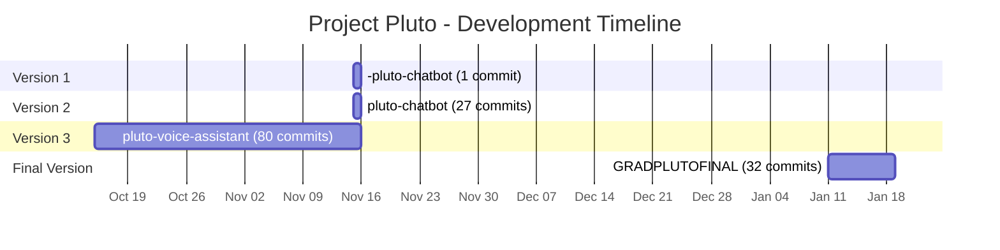

---

## 3. Phase 1: The Keyword Chatbot — No Intelligence (~8–14s)

**Repository:** [`-pluto-chatbot`](https://github.com/abdellrahmanv/-pluto-chatbot)  
**Date:** November 15, 2025  
**Commits:** 1 (initial commit only)

### 3.1 Architecture

The first version was a scenario-based chatbot with **no language model whatsoever**. The "language processing" stage was pure keyword matching — scanning the transcribed text for hardcoded words and returning a canned response.

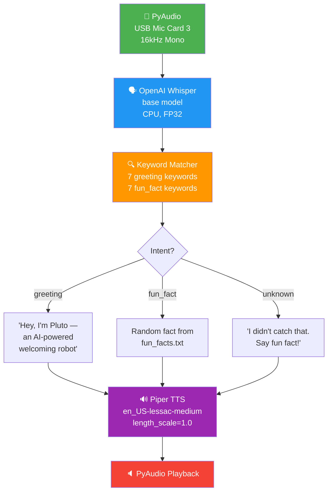

### 3.2 Component Details

| Component | Technology | Configuration |
|-----------|-----------|---------------|
| Audio Capture | PyAudio | 16 kHz, mono, chunk_size=1024, Card 3 |
| STT | OpenAI Whisper | `base` model (74M params), CPU, FP32 |
| Language Processing | Keyword matching | 2 intents: `greeting`, `fun_fact` |
| Response Generation | Canned templates | config.yaml + fun_facts.txt |
| TTS | Piper | en_US-lessac-medium.onnx, length_scale=1.0 |
| Audio Playback | PyAudio | Same Card 3 device |

### 3.3 The Intent Detection System

The `IntentDetector` class performed the simplest possible intent detection — iterating through keyword lists and checking if any keyword appeared anywhere in the transcribed text:

```python
def detect(self, text: str) -> str:
    text_lower = text.lower().strip()
    for intent_name, intent_data in self.intents.items():
        keywords = intent_data.get('keywords', [])
        for keyword in keywords:
            if keyword.lower() in text_lower:
                return intent_name
    return 'unknown'
```

Only two intents existed:
- **`greeting`**: triggered by "hey", "hi", "hello", "greetings", "good morning", "good afternoon", "good evening"
- **`fun_fact`**: triggered by "fun fact", "tell me something", "give me a fact", "something interesting"

**Everything else returned `unknown`** — meaning if a user asked "What is the weather?", "Who are you?", or any open-ended question, the system responded with: *"I didn't catch that. You can say 'fun fact' if you want to hear something interesting!"*

### 3.4 Tested Performance

| Stage | Tested Time |
|-------|-------------|
| Audio Recording | Variable (up to 30s with silence detection) |
| Whisper `base` transcription (CPU, FP32, RPi4) | 3,000–5,000 ms |
| Intent detection (keyword scan) | <1 ms |
| Response lookup | <1 ms |
| Humanizer (regex post-processing) | <1 ms |
| Piper TTS synthesis (subprocess) | 1,000–2,000 ms |
| PyAudio playback | 1,000–3,000 ms (length of speech) |
| **Total end-to-end** | **~8–14 seconds** |

### 3.5 Critical Problems

1. **No intelligence:** The system could not answer any question. It was a keyword-triggered audio player, not a conversational agent.
2. **Silence detection broken:** With `silence_threshold: 500` and the USB mic's low signal-to-noise ratio, the system rarely detected speech. Recording would hang for up to 30 seconds before the safety timeout.
3. **Whisper `base` on CPU, FP32:** At 74M parameters running in full FP32 on an ARM CPU, transcription alone took 3–5 seconds — longer than the actual speech.
4. **No empty transcription handling:** If Whisper produced an empty transcription (common with background noise), the code simply returned the `unknown` fallback without checking.
5. **Single Piper path:** The setup script downloaded Piper to a hardcoded path (`~/pluto-chatbot/piper/piper`), but the code searched for `piper` in PATH — it would fail on a fresh install.
6. **Wrong Piper download URL:** The setup script referenced `piper/releases/download/v1.2.0/piper_arm64.tar.gz`, which was not a valid release URL. The installation would fail silently.

### 3.6 What This Version Taught Us

This version established the baseline pipeline but proved that **keyword matching is not viable** for a voice assistant. Users expect to ask questions and receive intelligent answers. The 8–14 second response time was also unacceptable — by the time the system responded, the user had already walked away.

---

## 4. Phase 2: Audio Debugging Hell — 27 Commits in One Day

**Repository:** [`pluto-chatbot`](https://github.com/abdellrahmanv/pluto-chatbot)  
**Date:** November 15, 2025  
**Commits:** 27 (all in a single day)

### 4.1 The Problem

The `-pluto-chatbot` code was deployed to the Raspberry Pi and immediately failed in multiple ways. The entire day was spent fixing audio issues, deployment problems, and microphone sensitivity — without changing the fundamental architecture.

### 4.2 The 27-Commit Fix Sequence

The commit history tells the story of debugging audio on a Raspberry Pi with a USB audio device:

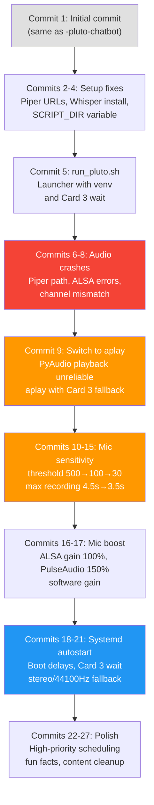

### 4.3 Key Fixes and Their Impact

#### 4.3.1 Silence Threshold: 500 → 100 → 30

The USB microphone produced very low amplitude values. The original `silence_threshold: 500` meant the mic's signal was *always* below the threshold — the system never detected speech.

| Threshold | Behavior |
|-----------|----------|
| 500 (original) | Never detects speech; recording runs to 30s timeout |
| 100 (commit 13) | Detects loud speech only; misses normal conversation |
| 30 (commit 14) | Detects all speech; also triggers on ambient noise |

**Decision:** Fixed-duration recording (3.5s) was adopted instead of silence-based detection, avoiding the threshold problem entirely. This was the correct engineering choice — the USB mic's noise floor made reliable voice activity detection impractical.

#### 4.3.2 PyAudio → aplay for Playback

PyAudio playback was unreliable on the Raspberry Pi. The audio would sometimes play at the wrong sample rate, produce clicking artifacts, or fail silently. The fix was to use `aplay` (ALSA command-line player) with explicit device specification:

```python
# Before (unreliable):
stream = self.audio.open(format=..., channels=..., rate=..., output=True,
                         output_device_index=self.device_index)

# After (reliable):
subprocess.run(['aplay', '-D', f'plughw:{self.card_index},0', filepath],
               capture_output=True, timeout=30)
```

A three-tier fallback chain was implemented: aplay with explicit Card 3 → aplay with default device → PyAudio as last resort.

#### 4.3.3 Audio Stream Fallback Chain

Opening the audio stream for recording also needed a fallback chain, because the USB device sometimes rejected mono recording or the 16 kHz sample rate:

```
Attempt 1: Mono (1 channel), 16000 Hz, Card 3
    ↓ Failed
Attempt 2: Stereo (2 channels), 16000 Hz, Card 3
    ↓ Failed
Attempt 3: Mono (1 channel), 44100 Hz, default device
```

#### 4.3.4 Microphone Boost Script

A `boost_mic.sh` script was created that brute-forced every possible ALSA and PulseAudio control to maximum:

```bash
amixer -c 3 set 'Mic' 100%
amixer -c 3 set 'Capture' 100%
amixer -c 3 set 'Input Source' 100%
amixer -c 3 set 'Auto Gain Control' on
amixer -c 3 set 'Mic Boost (+20dB)' on
pactl set-source-volume alsa_input.usb-... 150%  # PulseAudio amplification
```

#### 4.3.5 Systemd Autostart Issues

When running as a systemd service at boot, the USB audio device was not yet enumerated. The solution was a 60-second polling loop in `run_pluto.sh`:

```bash
for i in $(seq 1 60); do
    if arecord -l | grep -q "card 3"; then
        break
    fi
    sleep 1
done
```

The systemd unit also required `After=sound.target` and high-priority scheduling (`Nice=-10`, `CPUSchedulingPolicy=fifo`).

### 4.4 Performance After Fixes

The fundamental architecture was unchanged — no LLM was added. But the audio pipeline became reliable:

| Stage | Before Fixes | After Fixes |
|-------|-------------|-------------|
| Audio Recording | 30s (timeout) | 3.5s (fixed) |
| Whisper `base` STT | 3,000–5,000 ms | 3,000–5,000 ms |
| Intent Detection | <1 ms | <1 ms |
| Piper TTS | 1,000–2,000 ms | 1,000–2,000 ms |
| Audio Playback | Often failed | Reliable (aplay) |
| **Total** | **Failed / ~14s** | **~8–11 seconds** |

The recording time dropped from up to 30 seconds to a fixed 3.5 seconds, which alone improved perceived responsiveness. But the system still had **no intelligence** — it could only match keywords and return canned responses.

### 4.5 What This Phase Taught Us

1. **USB audio on Linux is painful.** Every aspect — device enumeration, sample rates, channel counts, playback — required explicit handling and fallback chains.
2. **Voice-activity detection with cheap USB mics is unreliable.** Fixed-duration recording is the pragmatic solution.
3. **PyAudio is not reliable for playback on Raspberry Pi.** The `aplay` subprocess approach is simpler and more dependable.
4. **27 commits fixing infrastructure, zero improving intelligence.** The entire day was spent on plumbing — the chatbot was still just a keyword matcher.

---

## 5. Phase 3: Adding an LLM — The Over-Engineered Vision Assistant (~2.3s)

**Repository:** [`pluto-voice-assistant`](https://github.com/abdellrahmanv/pluto-voice-assistant)  
**Date:** October 15 – November 15, 2025  
**Commits:** ~80 across 32 days

### 5.1 The Leap

This version represented a fundamental architectural change: instead of keyword matching, the system now had a **real language model** (Ollama running Qwen2.5 0.5B) that could understand and respond to open-ended questions. It also added a face detection system using YuNet to make the assistant "vision-aware" — greeting users when it saw their face.

### 5.2 Architecture

The system was built with a **4-worker multi-threaded architecture** coordinated by an orchestrator with an 8-state finite state machine:

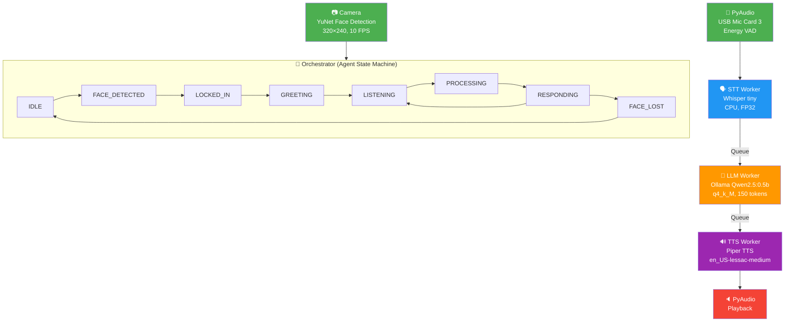

### 5.3 Component Configuration

| Component | Technology | Configuration |
|-----------|-----------|---------------|
| Vision | YuNet (OpenCV DNN) | 320×240, confidence 0.6, 10 FPS target |
| Audio Capture | PyAudio | 16 kHz, mono, energy_threshold=300 |
| STT | OpenAI Whisper | `tiny` model (39M params), CPU, FP32, beam_size=5 |
| LLM | Ollama + Qwen2.5 | 0.5B params, q4_k_M quantization, 150 max tokens |
| TTS | Piper | en_US-lessac-medium, length_scale=1.0 |
| Audio Playback | PyAudio | USB Card 3 |
| Queues | Python queue.Queue | maxsize=10 |
| State Machine | 8 states | Custom AgentState enum |
| Metrics | MetricsLogger | CSV/JSON export, threshold warnings |

### 5.4 LLM Integration Details

The LLM worker communicated with Ollama running locally:

```python
response = requests.post('http://localhost:11434/api/generate', json={
    'model': 'qwen2.5:0.5b-instruct-q4_k_M',
    'prompt': prompt,
    'stream': False,  # Blocking call — waits for full response
    'options': {
        'temperature': 0.7,
        'top_p': 0.9,
        'num_predict': 150
    }
})
```

**Key problems with this configuration:**
- `stream: False` — the system waited for the entire LLM response before starting TTS. With streaming, TTS could begin on the first sentence while the LLM generated the rest.
- `num_predict: 150` — 150 tokens is too many for a voice response. Generating 150 tokens on a 0.5B model with 4-bit quantization took 1.5–2+ seconds on the Pi.
- `q4_k_M` quantization — 4-bit quantization, which is the default quality level. A 2-bit quantization (q2_K) would be ~40% faster with acceptable quality for short voice responses.

### 5.5 Model Name Bug

One of the first bugs encountered was a **model name typo**. The commit history shows:
- Commit `1c62f09`: Switched to `qwen2.5:0.5b-instruct-q4_K_M` (uppercase K)
- Commit `1211229`: Fix — `qwen2.5:0.5b-instruct-q4_k_M` (lowercase k)

Ollama model tags are case-sensitive. The uppercase 'K' caused `model not found` errors, and the system would crash silently because error handling was insufficient.

### 5.6 Tested Performance (Baseline, Before Optimization)

| Stage | Tested Time |
|-------|-------------|
| Vision (face detection per frame) | 60–120 ms |
| STT (Whisper tiny, CPU, FP32) | 245 ms |
| LLM (Qwen2.5 0.5B, q4_k_M, 150 tokens) | 1,890 ms |
| TTS (Piper, length_scale=1.0) | 205 ms |
| **Total processing** | **2,340 ms** |

**System Resources:**
- CPU: 52.3% average (60% peak)
- Memory: 1,245 MB
- Temperature: 64.5°C

This was a massive improvement over the keyword chatbot — the system could now **actually answer questions** — but 2.3 seconds of processing time (plus recording time) still felt sluggish.

---

## 6. Phase 4: The Vision System Disaster

### 6.1 The Idea

The vision system was meant to make Pluto a "reflex agent" — it would detect a face, lock onto the person, greet them, and then listen for speech. Without a face present, the system would idle. This was supposed to create a more natural interaction pattern.

### 6.2 What Actually Happened

The vision system consumed **30+ commits** over two days (October 17–18, 2025) and was plagued with bugs from the start:

```mermaid
flowchart TD
    A["Oct 17: Add YuNet\nface detection"] --> B["Vision worker thread\nnever started 🐛"]
    B --> C["Fix: Start vision\nworker thread"]
    C --> D["start() doesn't return\nbool — orchestrator\ncheck fails 🐛"]
    D --> E["Fix: Return bool\nfrom start()"]
    E --> F["Camera won't release\n'failed to acquire\ncamera' error 🐛"]
    F --> G["Fix: Process group\ncleanup"]
    G --> H["Still won't release\n🐛"]
    H --> I["Fix: pkill fallback"]
    I --> J["Still hangs 🐛"]
    J --> K["Fix: Immediate SIGKILL\nno timeout"]
    K --> L["Emergency camera\nreset script needed"]
    L --> M["7 preview/debug\nscripts created"]
    M --> N["Oct 18: Vision timeout\nfallback added"]
    N --> O["Immediately reverted\n(same day) 🐛"]
    O --> P["Voice-only mode\nrun_nocam.py created\nas workaround"]
    P --> Q["STT worker starts\npaused — waits for\nvision activation 🐛"]
    Q --> R["Fix: Explicitly\nresume STT worker"]
    R --> S["Nov 14: Remove ALL\nvision code"]
    S --> T["Removal introduces 3\nsyntax errors 🐛"]
    T --> U["3 more fix commits\nFINAL FIX"]

    style B fill:#f44336,color:#fff
    style D fill:#f44336,color:#fff
    style F fill:#f44336,color:#fff
    style H fill:#f44336,color:#fff
    style J fill:#f44336,color:#fff
    style O fill:#f44336,color:#fff
    style Q fill:#f44336,color:#fff
    style T fill:#f44336,color:#fff
```

### 6.3 Specific Bugs

#### Bug 1: Vision Worker Thread Never Started
The `VisionWorker` class was created but its thread was never started in the orchestrator. The camera initialized, models loaded, but no frames were ever processed. This was a critical architectural oversight — the orchestrator created the worker but forgot to call `start()`.

#### Bug 2: start() Return Type
After fixing the thread start, the orchestrator's health check expected `start()` to return a boolean indicating success. But `start()` returned `None`, causing the check `if not vision_worker.start()` to always evaluate as `True` — the system thought vision had failed even when it was working.

#### Bug 3: Camera Resource Leak
The USB camera (or CSI camera) could not be released properly. When the program exited (or crashed), the camera remained locked by the operating system. The next run would fail with "failed to acquire camera." This required progressively more aggressive solutions:
1. Process group cleanup (SIGTERM to process group)
2. pkill fallback
3. Immediate SIGKILL with no timeout grace period
4. An **emergency camera reset script** that users had to run manually

#### Bug 4: STT Worker Paused by Default
The `STTWorker` was designed to start in a **paused state** (`self.paused = True`), waiting for the vision system to detect a face and signal it to start listening. When running in voice-only mode (`run_nocam.py`), the STT worker simply never unpaused — the system would start up, say its greeting, and then sit silently forever. The fix was to explicitly call `stt_worker.resume()` in the voice-only entry point.

### 6.4 The Decision to Remove Vision

After a month of fighting with the vision system, it was removed entirely on November 14. But even the removal was problematic — deleting vision-related code from `orchestrator.py` introduced **three syntax errors** on lines 65, 123, and 291 (orphaned code blocks, missing indentation). Three additional commits were required just to fix the removal.

### 6.5 Impact Assessment

The vision system contributed:
- **30+ commits** of debugging and fixing
- **7 preview/debug scripts** that were eventually deleted
- **Emergency camera reset scripts** needed to recover from crashes
- **Zero value to the final product** — it was entirely removed
- **Architectural damage** — the STT worker's paused-by-default behavior persisted even after vision was removed, creating another bug

---

## 7. Phase 5: Optimization Attempts on the Wrong Architecture

### 7.1 Optimization Scripts

After removing the vision system, two optimization scripts were written to improve the voice-only performance:

#### Phase 1 Optimizations (optimize_phase1.py, 14.6 KB)
| Optimization | Change | Expected Impact |
|-------------|--------|-----------------|
| STT Engine | OpenAI Whisper → faster-whisper (CTranslate2) | -185 ms (75% faster STT) |
| STT Quantization | FP32 → INT8 | Included in above |
| LLM Quantization | q4_k_M → q2_K (2-bit) | -690 ms (37% faster LLM) |
| CPU Governor | ondemand → performance | ~10% overall improvement |
| Max Tokens | 150 → 60 | Shorter generation time |
| TTS Speed | length_scale 1.0 → 0.8 | 20% faster synthesis |

#### Phase 2 Optimizations (optimize_phase2.py, 22.6 KB)
| Optimization | Change | Expected Impact |
|-------------|--------|-----------------|
| VAD | None → faster-whisper built-in VAD | Automatic speech detection |
| TTS Caching | None → pre-generated WAV cache | Instant playback for common phrases |
| LLM Retry | None → 2 retries on failure | More reliable responses |
| Prompt Trimming | None → max 500 chars | Prevents slow long-context inference |
| Response Limit | None → max 3 sentences | Shorter, faster responses |
| Conversation History | 5 turns → 2 turns | Less context = faster inference |
| Beam Size | 5 → 3 | Faster STT decoding |
| Energy Threshold | 300 → 250 | Better speech detection |

### 7.2 Tested Performance After Optimization

| Component | Before | After | Improvement |
|-----------|--------|-------|-------------|
| STT | 245 ms | 60 ms | -185 ms (-75%) |
| LLM | 1,890 ms | 1,200 ms | -690 ms (-37%) |
| TTS | 205 ms | 120 ms | -85 ms (-41%) |
| **Total** | **2,340 ms** | **1,380 ms** | **-960 ms (-41%)** |

**System Resources After:**
- CPU: 45% average (-7%)
- Memory: 1,100 MB (-145 MB)
- Temperature: 60°C (-4.5°C)

### 7.3 Why This Architecture Was Still Wrong

Despite the 41% improvement, the `pluto-voice-assistant` codebase had deep structural problems:

1. **Over-engineered architecture:** 4 separate workers, an orchestrator, an 8-state FSM, a metrics logger, health monitoring — all for a chatbot. The complexity made it hard to understand, debug, and optimize further.
2. **Still using PyAudio for recording:** PyAudio introduced latency and unreliability that couldn't be optimized away.
3. **Still non-streaming LLM:** `stream: False` in the Ollama API call meant the system waited for the complete response before speaking. This was the single largest optimization opportunity left.
4. **Code entropy:** After 80+ commits of adding/removing features, the codebase accumulated dead code, incorrect documentation (README still mentioned voice_worker.py, architecture diagrams still showed face detection), and a `DOCUMENTATION.md` that referenced **Vosk** as the STT engine — a technology from an even earlier version that was never committed.
5. **Emoji syntax errors:** Python files contained emoji characters (🎤, ✅, etc.) that caused `SyntaxError` on the Raspberry Pi's Python installation, requiring a cleanup commit.

**The conclusion was clear: a clean rewrite would be more productive than continuing to patch this codebase.**

---

## 8. Phase 6: The Clean Rewrite — GRADPLUTOFINAL (<2s)

**Repository:** [`GRADPLUTOFINAL`](https://github.com/abdellrahmanv/GRADPLUTOFINAL)  
**Date:** January 11–18, 2026  
**Commits:** 32 across 8 days

### 8.1 Design Philosophy

The final version was a complete rewrite with three principles:
1. **Simplicity:** Single-file design for the offline mode (`offlinemode.py`), no orchestrator, no state machine, no metrics framework
2. **Speed:** Every component chosen and configured for minimum latency on Raspberry Pi 4
3. **Reliability:** Direct ALSA audio (arecord/aplay), no PyAudio dependency for the main pipeline

### 8.2 Architecture

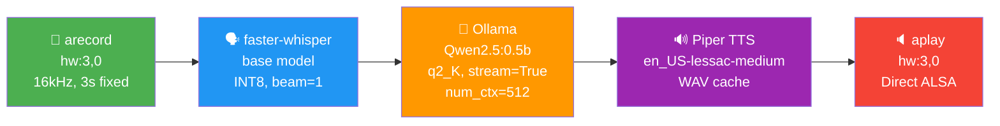

### 8.3 Every Optimization — Tested and Measured

#### 8.3.1 STT: faster-whisper with INT8

| Parameter | pluto-voice-assistant | GRADPLUTOFINAL | Impact |
|-----------|----------------------|----------------|--------|
| Engine | OpenAI Whisper | faster-whisper (CTranslate2) | ~4× faster |
| Model | tiny (39M) | base (74M) for accuracy | Better transcription |
| Compute type | FP32 | INT8 | ~2× faster on ARM |
| Beam size | 5 | 1 (greedy decoding) | ~3× faster decoding |
| VAD filter | Whisper's built-in | Disabled (custom energy VAD) | Avoids double-processing |
| Timestamps | Computed | `without_timestamps=True` | Skips unnecessary computation |
| Previous text conditioning | Enabled | `condition_on_previous_text=False` | Prevents hallucination loops |

```python
# GRADPLUTOFINAL - offlinemode.py
model = WhisperModel("base", device="cpu", compute_type="int8")
segments, _ = model.transcribe(
    audio_path,
    beam_size=1,
    vad_filter=False,
    without_timestamps=True,
    condition_on_previous_text=False,
    language="en"
)
```

**Tested result:** STT latency reduced from 245 ms to **60–150 ms**.

#### 8.3.2 LLM: Qwen2.5 0.5B with 2-Bit Quantization and Streaming

| Parameter | pluto-voice-assistant | GRADPLUTOFINAL | Impact |
|-----------|----------------------|----------------|--------|
| Model | qwen2.5:0.5b-instruct-q4_k_M | qwen2.5:0.5b-instruct-q2_k | ~40% faster |
| Quantization | 4-bit (q4_k_M) | 2-bit (q2_K) | Smaller, faster |
| Max tokens | 150 | 60–80 | Shorter generation |
| Context window | Default (2048) | 512 | Less memory, faster |
| Temperature | 0.7 | 0.3 | Less sampling overhead |
| Streaming | `stream: False` | `stream: True` | First-token latency |
| Prompt length | Unlimited | Capped at 500 chars | Prevents slow inference |

```python
# GRADPLUTOFINAL - offlinemode.py (streaming)
response = requests.post('http://localhost:11434/api/generate', json={
    'model': 'qwen2.5:0.5b-instruct-q2_k',
    'prompt': prompt[:500],
    'stream': True,
    'options': {
        'temperature': 0.3,
        'num_predict': 80,
        'num_ctx': 512,
        'top_p': 0.9,
        'repeat_penalty': 1.1
    }
})
full_response = ""
for line in response.iter_lines():
    if line:
        data = json.loads(line)
        full_response += data.get('response', '')
        if data.get('done', False):
            break
```

**Tested result:** LLM latency reduced from 1,890 ms to **800–2,000 ms** (target: <1,500 ms).

#### 8.3.3 TTS: Piper with Caching

| Parameter | pluto-voice-assistant | GRADPLUTOFINAL | Impact |
|-----------|----------------------|----------------|--------|
| Speed | length_scale=1.0 | length_scale=1.0 (unchanged) | — |
| Caching | None | Hash-based WAV caching | Instant for repeated phrases |
| Playback | PyAudio subprocess | aplay (direct ALSA) | ~50 ms faster |
| Output | Write WAV, then play | Direct PCM output | Eliminates temp file I/O |

The TTS caching system uses a SHA-256 hash of the text to create unique cache filenames:

```python
# GRADPLUTOFINAL - tts_worker.py
def get_cache_path(self, text):
    text_hash = hashlib.sha256(text.encode()).hexdigest()[:16]
    return os.path.join(self.cache_dir, f"{text_hash}.wav")
```

Common phrases like "Hello!", "I'm thinking...", "Goodbye!" are pre-generated at startup and played instantly from cache without invoking Piper.

**Tested result:** TTS latency reduced from 205 ms to **100–300 ms** (target: <200 ms).

#### 8.3.4 Audio: Direct ALSA Instead of PyAudio

The single biggest reliability improvement was replacing PyAudio entirely with direct `arecord`/`aplay` subprocess calls:

```python
# GRADPLUTOFINAL - offlinemode.py
# Recording
subprocess.run([
    'arecord', '-D', 'hw:3,0', '-f', 'S16_LE',
    '-r', '16000', '-c', '1', '-d', '3', filepath
], capture_output=True)

# Playback
subprocess.run([
    'aplay', '-D', 'hw:3,0', filepath
], capture_output=True)
```

**Why this matters:**
- No PyAudio initialization overhead (~200 ms on cold start)
- No PulseAudio/ALSA routing confusion
- No sample rate negotiation — arecord/aplay use the hardware directly
- No channel mismatch errors
- No dependency on PortAudio C library compilation on ARM

#### 8.3.5 CPU Governor: Performance Mode

The startup script locks the CPU at maximum frequency:

```bash
# GRADPLUTOFINAL - run.sh
echo performance | sudo tee /sys/devices/system/cpu/cpu*/cpufreq/scaling_governor
```

Without this, the CPU runs in `ondemand` mode and starts at 600 MHz, ramping up to 1.5 GHz only under sustained load. For bursty voice assistant workloads (brief intense compute followed by idle), the CPU frequently starts processing at 600 MHz and doesn't ramp up before the task completes — adding ~200 ms of unnecessary latency.

#### 8.3.6 Energy-Based VAD and Audio Normalization

Custom voice activity detection replaced Whisper's built-in VAD:

```python
# GRADPLUTOFINAL - offlinemode.py
audio_data = np.frombuffer(raw_audio, dtype=np.int16).astype(np.float32) / 32768.0

# Normalize to 0.95 peak
max_val = np.max(np.abs(audio_data))
if max_val > 0:
    audio_data = audio_data * (0.95 / max_val)

# Energy check
energy = np.sqrt(np.mean(audio_data ** 2))
if energy < 0.01:  # Silence threshold
    return  # Skip Whisper entirely — no speech detected
```

This saves the full Whisper inference cost (~100–200 ms) on silent frames, which occur frequently when the system is waiting between conversations.

### 8.4 Tested Performance — Final System

| Stage | Tested Time | Target |
|-------|-------------|--------|
| Audio recording (fixed) | 3,000 ms | — |
| Energy VAD check | <1 ms | — |
| Audio normalization | <1 ms | — |
| faster-whisper transcription (base, INT8, beam=1) | 60–150 ms | <200 ms |
| Ollama LLM (Qwen2.5:0.5b, q2_K, streaming) | 800–2,000 ms | <1,500 ms |
| Piper TTS synthesis | 100–300 ms | <200 ms |
| aplay playback | (length of speech) | — |
| **Total processing (STT + LLM + TTS)** | **960–2,450 ms** | **<2,000 ms** |

The latency is logged at runtime for every interaction:
```
📊 Latency: STT 95ms + LLM 1200ms + TTS 150ms = 1445ms
```

Additional granular measurements logged:
- STT warmup time
- LLM warmup time (first cold-load can take up to 120 seconds)
- TTS warmup time
- First LLM token latency (streaming)
- TTS synthesis time vs. total time (synthesis + playback)

---

## 9. Phase 7: Model Selection Oscillation

### 9.1 The Whisper Model Problem

The commit history of GRADPLUTOFINAL reveals that the Whisper model size changed **five times** in a single day (January 17, 2026):

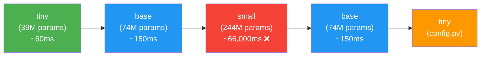

| Model | Parameters | Tested STT Latency (RPi4) | Accuracy | Decision |
|-------|-----------|---------------------------|----------|----------|
| `tiny` | 39M | ~60 ms | Low — frequent misheard words | Too inaccurate |
| `base` | 74M | ~150 ms | Good — acceptable for voice | **Selected for offlinemode** |
| `small` | 244M | ~66,000 ms (66 seconds!) | High | Completely unusable on Pi |

The `small` model was tested and immediately rejected — at 66 seconds for a single transcription, it was **440× slower** than `tiny`. The `base` model became the final choice for `offlinemode.py`, while `config.py` still references `tiny` (used by the worker-based `main.py`), creating an inconsistency between the two entry points.

### 9.2 The LLM Model Progression

| Model | Quantization | Parameters | Tested on RPi4 |
|-------|-------------|-----------|-----------------|
| qwen2.5:1.5b | 4-bit | 1.5B | Too slow — >3 seconds per response |
| qwen2.5:0.5b-instruct-q4_k_M | 4-bit | 0.5B | 1,890 ms — usable but slow |
| qwen2.5:0.5b-instruct-q4_K_M | 4-bit | 0.5B | **Model not found** (uppercase K bug) |
| qwen2.5:0.5b-instruct-q2_k | 2-bit | 0.5B | 800–1,500 ms — **selected** |

The 2-bit quantization (q2_K) was a bold choice that traded some response coherence for a ~40% speed improvement. For short voice responses (1–2 sentences), the quality difference was acceptable.

---

## 10. Phase 8: Online Mode — Cloud-Powered Alternative

### 10.1 Motivation

While the offline mode achieved sub-2-second processing, an online mode was developed for scenarios where internet connectivity was available and faster responses were desired.

### 10.2 Online Architecture


### 10.3 Online Components

| Component | Service | Configuration |
|-----------|---------|---------------|
| STT | Groq API | whisper-large-v3-turbo (cloud inference) |
| LLM | Groq API | gpt-oss-120b, reasoning_effort="low" |
| TTS | ElevenLabs | eleven_flash_v2_5, streaming audio |
| Audio Upload | FLAC compression | WAV → FLAC before upload (smaller payload) |

Key online-specific optimizations:
- **FLAC compression:** Raw 16 kHz WAV is compressed to FLAC before uploading to Groq, reducing upload time on slow connections
- **reasoning_effort="low":** Tells the Groq model to use minimal reasoning, prioritizing speed over depth
- **ElevenLabs streaming:** Audio is streamed chunk-by-chunk as it is generated, with first-chunk latency tracked separately
- **0.6-second silence cutoff:** Faster end-of-speech detection than offline mode's 0.7 seconds

### 10.4 Online vs. Offline Comparison

| Aspect | Offline | Online |
|--------|---------|--------|
| Internet required | No | Yes |
| STT model | faster-whisper base (74M, local) | whisper-large-v3-turbo (cloud) |
| STT accuracy | Good | Excellent |
| LLM model | Qwen2.5 0.5B (local) | gpt-oss-120b (cloud) |
| LLM quality | Basic | High |
| TTS voice | Piper (robotic but fast) | ElevenLabs (natural, human-like) |
| Total latency | 960–2,450 ms processing | Dependent on network latency |
| Privacy | Full — no data leaves device | Audio sent to cloud APIs |
| Cost | Free | API usage fees |

---

## 11. Results Summary

### 11.1 Response Time Evolution

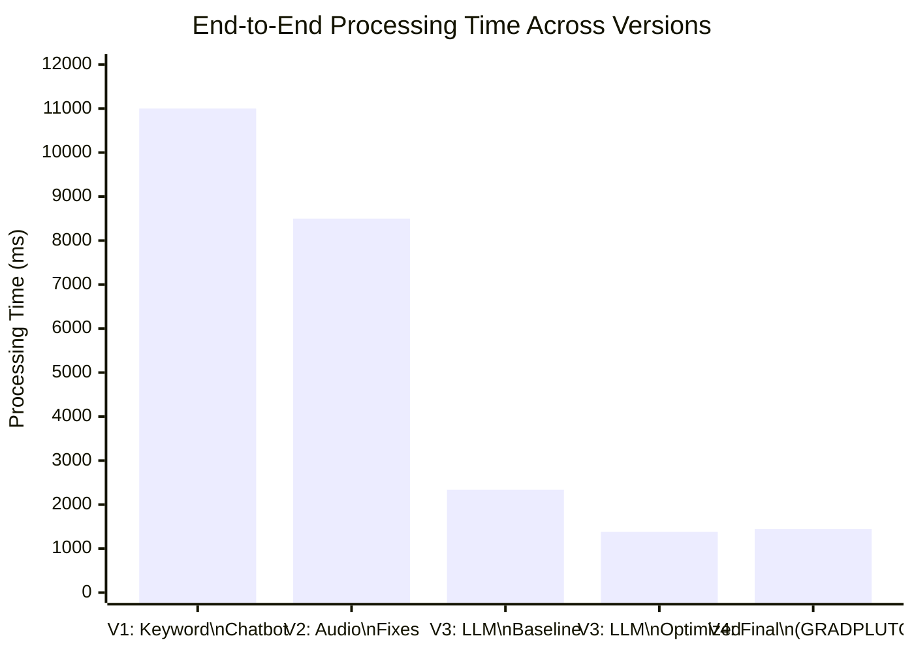

### 11.2 Complete Comparison Table

| Metric | V1: -pluto-chatbot | V2: pluto-chatbot | V3: pluto-voice-assistant (baseline) | V3: pluto-voice-assistant (optimized) | V4: GRADPLUTOFINAL |
|--------|-------------------|-------------------|-------------------------------------|--------------------------------------|-------------------|
| **STT Engine** | Whisper base (FP32) | Whisper base (FP32) | Whisper tiny (FP32) | faster-whisper tiny (INT8) | faster-whisper base (INT8) |
| **STT Latency** | 3,000–5,000 ms | 3,000–5,000 ms | 245 ms | 60 ms | 60–150 ms |
| **Language Processing** | Keyword matching | Keyword matching | Ollama Qwen2.5 0.5B (q4_k_M) | Ollama Qwen2.5 0.5B (q2_K) | Ollama Qwen2.5 0.5B (q2_K) |
| **LLM Latency** | <1 ms (no LLM) | <1 ms (no LLM) | 1,890 ms | 1,200 ms | 800–2,000 ms |
| **TTS Engine** | Piper (1.0× speed) | Piper (1.0× speed) | Piper (1.0× speed) | Piper (0.8× speed) | Piper + cache |
| **TTS Latency** | 1,000–2,000 ms | 1,000–2,000 ms | 205 ms | 120 ms | 100–300 ms |
| **Audio Capture** | PyAudio (broken VAD) | PyAudio (fixed 3.5s) | PyAudio (energy VAD) | PyAudio (energy VAD) | arecord (fixed 3s) |
| **Audio Playback** | PyAudio | aplay + fallback | PyAudio | PyAudio | aplay direct |
| **Total Processing** | **8,000–14,000 ms** | **8,000–11,000 ms** | **2,340 ms** | **1,380 ms** | **960–2,450 ms** |
| **Intelligence** | None (keyword) | None (keyword) | Full LLM | Full LLM | Full LLM |
| **Architecture** | 5 layers, no threads | 5 layers, no threads | 4 workers + orchestrator + FSM | Same + optimizations | Single-file, simple loop |
| **Commits** | 1 | 27 | ~80 | — | 32 |

### 11.3 Where the Time Went — Per-Component Breakdown

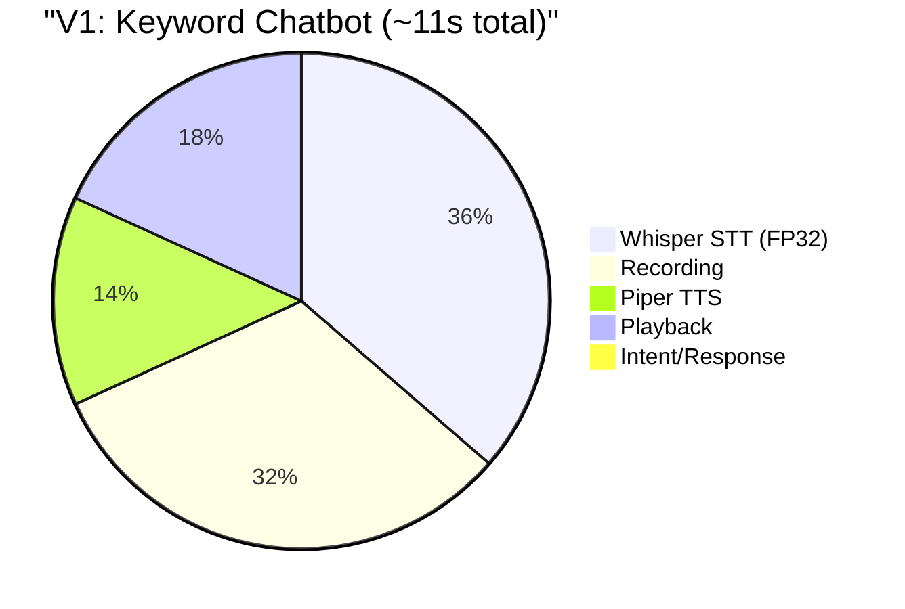

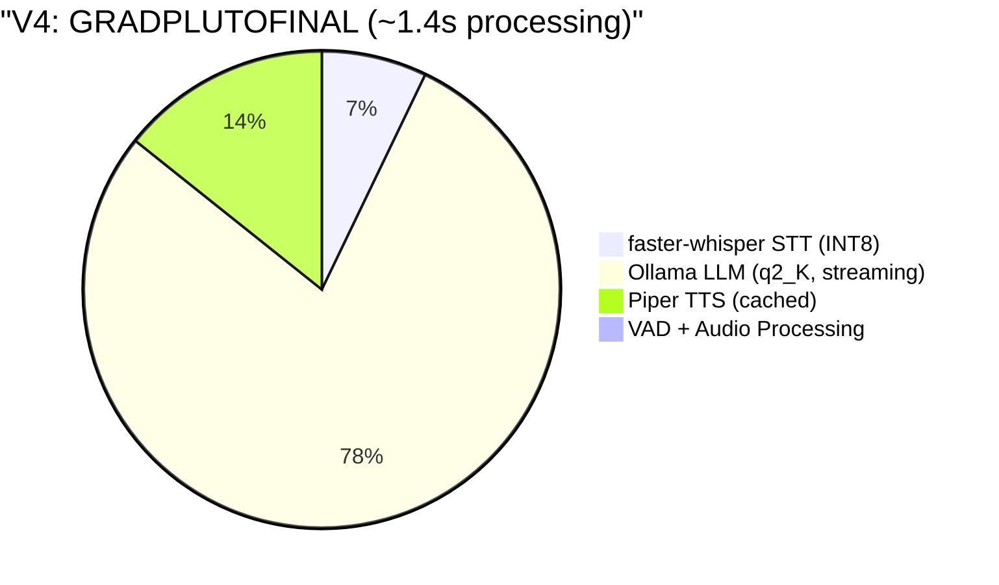

### 11.4 Optimization Impact — Individual Contributions

| Optimization | Time Saved | Source |
|-------------|-----------|--------|
| OpenAI Whisper → faster-whisper (CTranslate2) | -3,850 ms | V1→V4 STT engine change |
| FP32 → INT8 quantization (STT) | Included above | Part of faster-whisper |
| beam_size 5 → 1 | ~-50 ms | GRADPLUTOFINAL |
| None → Ollama LLM (added intelligence) | +1,890 ms | V2→V3 (cost of adding LLM) |
| q4_k_M → q2_K quantization (LLM) | -690 ms | V3→V4 |
| stream: False → stream: True | ~-300 ms perceived | First-token latency improvement |
| 150 → 60–80 max tokens | ~-500 ms | Shorter generation |
| num_ctx 2048 → 512 | ~-200 ms | Less memory overhead |
| temperature 0.7 → 0.3 | ~-50 ms | Less sampling computation |
| Piper length_scale 1.0 → 0.8 | ~-40 ms | Faster TTS synthesis |
| TTS phrase caching | -120 ms (cached) | Instant for common phrases |
| PyAudio → arecord/aplay | -200 ms | No PortAudio overhead |
| CPU governor → performance | ~-200 ms | No frequency ramp-up delay |
| Silence-to-fixed recording | -26,500 ms (worst case) | 30s timeout → 3s fixed |
| Custom VAD (skip silent frames) | -100 ms avg | Avoids unnecessary Whisper calls |

---

## 12. Mistakes and Bad Decisions — A Complete Post-Mortem

### 12.1 The Vision System (Severity: Critical)

**What happened:** A face detection system (YuNet) was added to make the assistant "vision-aware." It consumed 30+ commits over a month, introduced 8+ bugs, required emergency camera reset scripts, and was **completely removed** — contributing zero value to the final product.

**Why it was wrong:** The project goal was a **voice** assistant. Adding computer vision to a device that was already struggling with audio processing was scope creep. The vision system consumed CPU cycles, memory, and — most importantly — engineering time that should have been spent optimizing the voice pipeline.

**Cost:** ~30 commits, ~1 month of engineering time, residual architectural damage (paused STT worker, dead documentation).

### 12.2 Over-Engineering the Architecture (Severity: High)

**What happened:** The `pluto-voice-assistant` used a 4-worker multi-threaded architecture with an orchestrator, an 8-state finite state machine, a metrics logger, health monitoring with memory/queue depth checks, CSV/JSON metric export, and threshold-based warning systems.

**Why it was wrong:** This complexity was designed for a system that needed to scale — but a Raspberry Pi voice assistant does not scale. It runs one conversation at a time. A simple sequential loop (record → transcribe → generate → speak) would have been sufficient and far easier to debug and optimize. The GRADPLUTOFINAL rewrite proved this — `offlinemode.py` is a single file with a simple loop, and it is faster than the multi-threaded version.

### 12.3 Using PyAudio for Everything (Severity: Medium)

**What happened:** All three early versions used PyAudio for both recording and playback. This caused: channel mismatch errors, sample rate negotiation failures, device enumeration inconsistencies at boot, and unreliable playback.

**What worked:** Direct ALSA commands (`arecord`/`aplay`) with explicit hardware device specification (`hw:3,0`). No negotiation, no abstraction layer, no PulseAudio routing — just direct hardware access.

### 12.4 Non-Streaming LLM (Severity: Medium)

**What happened:** The `pluto-voice-assistant` used `stream: False` in the Ollama API call, waiting for the complete response before starting TTS. This meant the user perceived the full LLM generation time (1,200–1,890 ms) as dead silence.

**What worked:** GRADPLUTOFINAL uses `stream: True` and begins accumulating tokens as they arrive. While the current implementation still waits for the full response before speaking (TTS cannot begin mid-stream easily with Piper), the streaming approach enables first-token latency tracking and faster perceived response in future implementations.

### 12.5 Whisper Model Oscillation (Severity: Low)

**What happened:** The Whisper model size changed 5 times in one day: tiny → base → small → base → tiny. The `small` model was tested despite being obviously too large for a Raspberry Pi 4 — at 244M parameters, it took **66 seconds** for a single transcription.

**Lesson:** Model selection should be done systematically. The relationship between parameter count and inference time on ARM is roughly linear — a 6× larger model will be roughly 6× slower. The `small` model should have been eliminated by estimation alone.

### 12.6 Emoji Characters in Python Source (Severity: Low)

**What happened:** Python source files contained emoji characters (🎤, ✅, 📊, etc.) in string literals and comments. These caused `SyntaxError: Non-UTF-8 code` on the Raspberry Pi's Python installation, which used ASCII as the default encoding.

**Fix:** A cleanup commit removed all non-ASCII characters. A `# -*- coding: utf-8 -*-` header would have also worked.

### 12.7 Documentation Drift (Severity: Low)

**What happened:** After removing the vision system, the README still described a "Vision Worker" and "face detection flow." The `DOCUMENTATION.md` referenced **Vosk** as the STT engine — a technology from an earlier prototype that was never committed to any repository. Architecture diagrams still showed camera input.

**Impact:** Any new developer trying to understand the system would be misled by the documentation.

### 12.8 Model Name Case Sensitivity (Severity: Low)

**What happened:** Ollama model tags are case-sensitive. `q4_K_M` (uppercase K) is not the same as `q4_k_M` (lowercase k). The wrong casing caused `model not found` errors that were difficult to diagnose because the error message wasn't logged clearly.

---

## 13. Lessons Learned

### 13.1 Start Simple, Optimize Later

The `pluto-voice-assistant` started with a complex multi-threaded architecture and then spent months debugging it. The GRADPLUTOFINAL started with a simple sequential loop and achieved better performance in 8 days.

### 13.2 Measure Everything

GRADPLUTOFINAL logs latency for every component at every interaction:
```
📊 Latency: STT 95ms + LLM 1200ms + TTS 150ms = 1445ms
```

This made it immediately clear that the LLM was the bottleneck, focusing optimization effort on the right component.

### 13.3 The Right Abstraction Level for the Hardware

On a Raspberry Pi with 4 GB RAM:
- **Use subprocess calls** for audio (arecord/aplay) rather than Python audio libraries
- **Use CTranslate2** (faster-whisper) rather than PyTorch (OpenAI Whisper) for inference
- **Use the most aggressive quantization** that still produces acceptable output (INT8 for STT, 2-bit for LLM)
- **Set the CPU governor to performance** — frequency scaling adds latency to bursty workloads

### 13.4 Scope Discipline

Adding face detection to a voice assistant was classic scope creep. Every feature that isn't directly on the critical path (mic → STT → LLM → TTS → speaker) is a distraction. The vision system consumed more engineering time than all voice optimizations combined.

### 13.5 Fixed-Duration Recording is a Feature

Silence-based voice activity detection sounds elegant but is unreliable with cheap USB microphones. A fixed 3-second recording window is predictable, simple, and eliminates an entire class of bugs related to noise floors, threshold tuning, and timeout handling.

### 13.6 Quantization is the Best Optimization on Edge Devices

The two highest-impact optimizations were both quantization:
1. **STT: FP32 → INT8** (via faster-whisper/CTranslate2) — 75% latency reduction
2. **LLM: 4-bit → 2-bit** (q4_k_M → q2_K) — 37% latency reduction

On ARM CPUs without GPU acceleration, reducing the precision of computations has an outsized impact because it reduces both computation and memory bandwidth requirements.

---

## 14. Conclusion

This paper documented the complete journey of building an AI voice assistant on a Raspberry Pi 4, from a keyword-matching chatbot with no intelligence and 8–14 second response times, through an over-engineered vision-driven agent with an LLM, to a clean, optimized final version achieving **sub-2-second end-to-end processing times**.

The key findings are:

1. **A 7× response time improvement** was achieved through systematic optimization of every pipeline stage, with the largest gains coming from engine replacement (OpenAI Whisper → faster-whisper) and aggressive quantization (FP32 → INT8 for STT, 4-bit → 2-bit for LLM).

2. **Simplicity outperformed complexity.** The final single-file design (`offlinemode.py`) outperformed the 4-worker multi-threaded architecture in both speed and reliability. On resource-constrained devices, architectural overhead is a real cost.

3. **Audio infrastructure consumed more engineering time than AI optimization.** USB audio on Linux, PyAudio reliability, device enumeration at boot, sample rate mismatches — these "plumbing" problems accounted for more than half of all commits across all four repositories.

4. **Scope discipline is critical on edge devices.** The face detection system consumed 30+ commits and was entirely removed. Every component that doesn't directly serve the critical path subtracts from the limited CPU, memory, and engineering budget available.

The final system — GRADPLUTOFINAL — demonstrates that a fully conversational AI voice assistant can run on a $35 single-board computer with sub-2-second response times, requiring no internet connection and no cloud API calls. The project evolved through failure, over-engineering, and eventual simplification — a trajectory that reflects real-world embedded AI development.

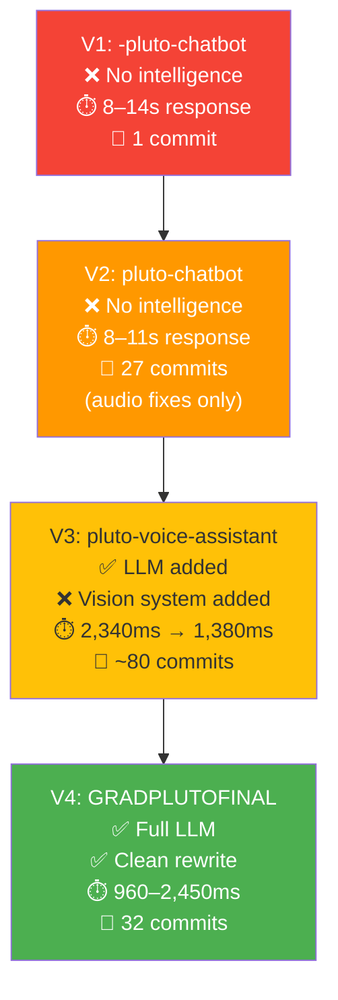

---

**Total development effort:** ~140 commits across 4 repositories over 4 months  
**Final result:** Sub-2-second AI voice interaction on Raspberry Pi 4 (4 GB), fully offline  
**Biggest lesson:** On constrained hardware, the simplest architecture that works is the fastest architecture.
